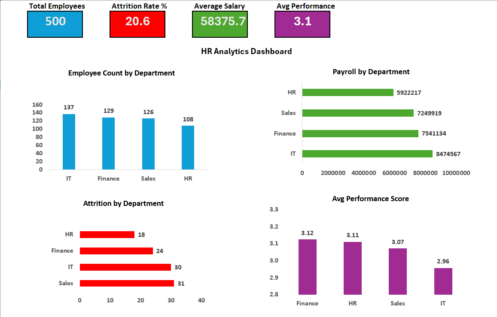
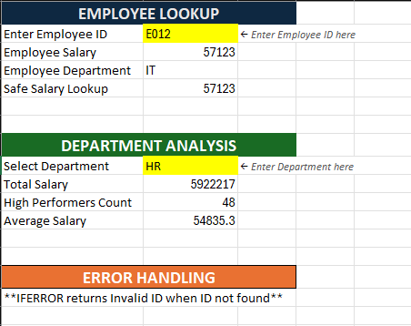
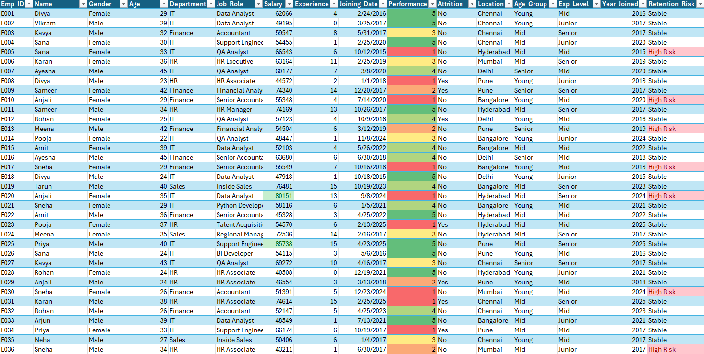

# HR Analytics Dashboard in Excel

## Project Overview
This project is an interactive **HR Analytics Dashboard** built in **Microsoft Excel** to analyze workforce data and generate business insights. It demonstrates advanced Excel skills including formulas, Pivot Tables, charts, KPI cards, conditional formatting, and dashboard design.

The dashboard helps HR teams and management monitor:

- Total Employees
- Attrition Rate
- Average Salary
- Average Performance Score
- Department-wise Headcount
- Payroll by Department
- Attrition by Department
- Department Performance Comparison

---

## Tools & Skills Used

- Microsoft Excel
- Pivot Tables
- Pivot Charts
- XLOOKUP
- VLOOKUP
- SUMIF
- COUNTIFS
- AVERAGEIFS
- IF / IFERROR
- Conditional Formatting
- Data Validation
- Dashboard Design
- KPI Cards

---

## Key Features

### Dashboard Sheet
- Executive KPI cards
- Interactive charts
- Clean professional layout
- Department insights

### Raw Data Sheet
- Structured employee dataset
- Calculated columns
- Highlighting & formatting

### Formula Sheet
- Employee lookup system
- Department salary summary
- High performer analysis
- Error handling formulas

---

## Business Insights Generated

- Identified department with highest headcount
- Calculated attrition percentage
- Compared average performance across departments
- Analyzed payroll allocation by department
- Highlighted high-performing employee groups

---

##  Project Screenshots

### Dashboard Overview  

### Formula Sheet  

### Raw Data View  

---

## 📁 Files Included

- `HR_Analytics_Dataset_500Rows_Final.xlsx`
- `README.md`
- `screenshots/`

---

##  Resume Value

Built an HR Analytics Dashboard in Excel using Pivot Tables, advanced formulas, KPI cards, charts, and conditional formatting to analyze employee attrition, salary, and performance metrics.

---

##  Author

Created by Taqi JPG
